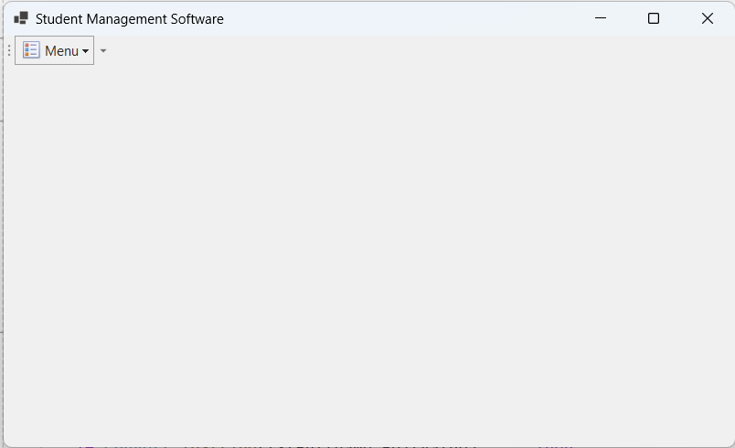
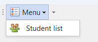
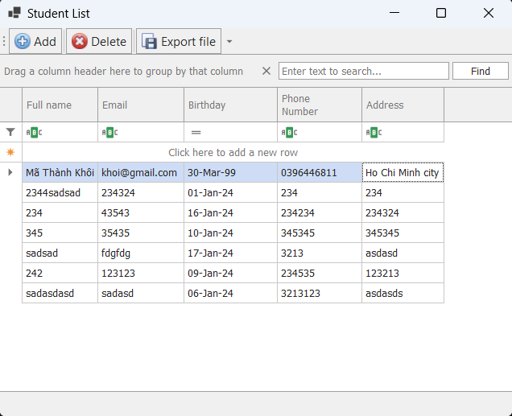
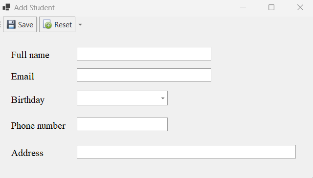
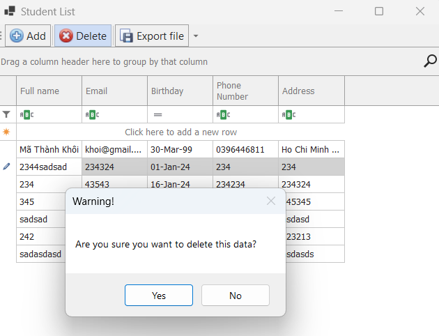
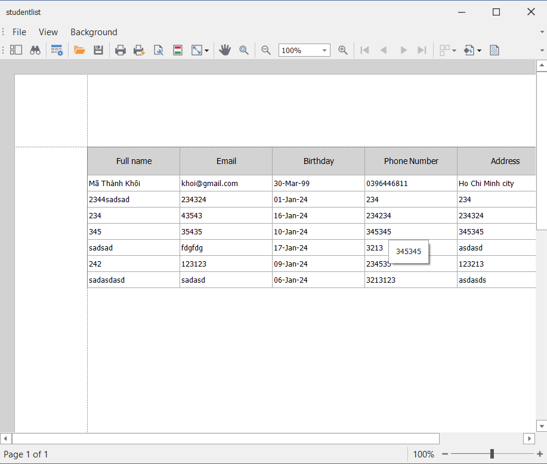
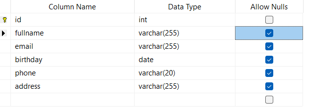

# STUDENT MANAGEMENT SOFTWARE

Your project is a software designed for life management, comprising functions such as add, delete, and edit.

## Tech stack

- Visual Basic .NET
- [DevExpress][DevExpress]
- SQL Server

## SOLUTION DESIGN

The software is designed with a main form and a student management form.

### 1. Main form

The main form displays a dropdown menu button as shown in the image:

- If the user clicks on the menu button, a list will appear as shown in the image:
  

- When the user clicks on the "Student list" button, the student management form will appear.

### 2. Student management form

The student management form includes functional buttons for adding, deleting, and editing, as well as a table displaying the list of students.

- The "Add" button is used to add new data. When the user clicks on this button, a form will appear for the user to enter information.This form has two functional buttons, including the "Save" button for saving data to the database and the "Reset" button to help users quickly clear information.
  

- The "Delete" button is used to remove data. This button helps users delete data from the currently selected row with a mouse click. After pressing the delete button, a confirmation prompt will appear. If the user clicks "Yes," the data will be deleted; if they click "No," the data will be retained.
  

- The "Export file" button is used to export the student list to a PDF file format.
  
- In addition, users can directly add or update information on the student list table.

## DATABASE

The db_student database is designed to store information about students. This database consists of a table with six columns as follows:

1. id (primary key, auto-increment):
   This column is set as the primary key, meaning a unique value is automatically generated and assigned to each record. It is typically used to uniquely identify each student in the table.

2. fullname:
   This column stores the full name of the student.

3. email:
   This column contains the email address of the student.

4. birthday:
   This column stores the birthdate of the student.

5. phone:
   This column holds the contact phone number of the student.

6. address:
   This column stores the address of the student.

[DevExpress]: https://www.devexpress.com/
